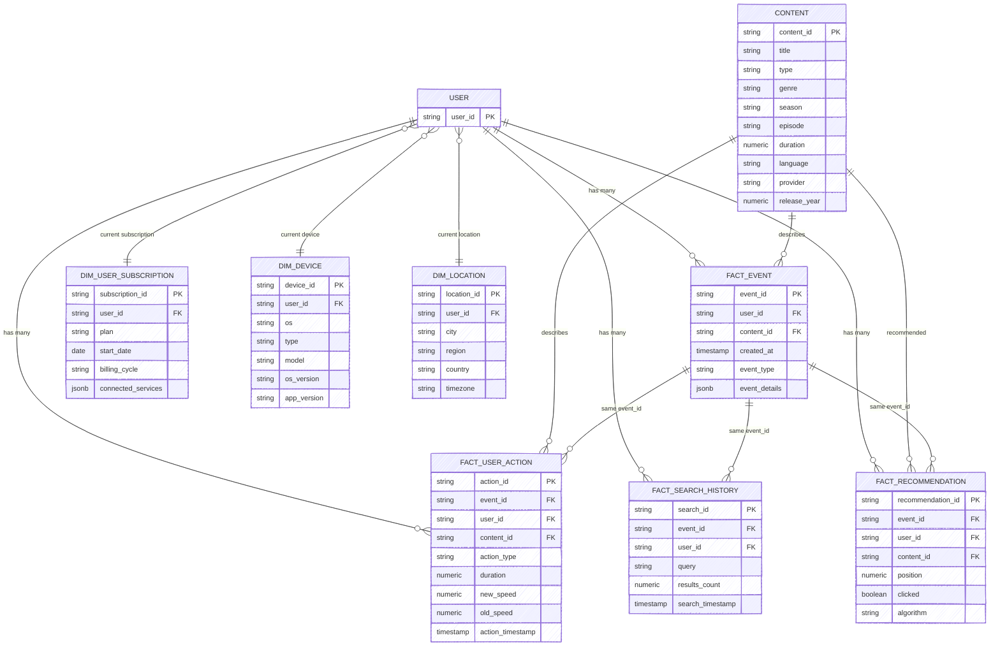

# Real-Time Customer Event Data Pipeline

## Overview

This project implements a comprehensive real-time data engineering pipeline that generates synthetic customer event data, streams it through Apache Kafka with Avro serialization, consumes and processes the data, and persists it in multiple storage formats. The pipeline demonstrates modern data engineering practices including containerized infrastructure, schema management, and scalable data processing.

## Architecture


## Core Components

### 1. Data Generation (`src/producer/`)

The producer module generates realistic synthetic customer event data simulating user interactions with a media streaming platform.

**Key Features:**
- **Event Types**: content_play, search, browse
- **Data Components**: Device info, location, content metadata, user actions, recommendations, search history
- **Serialization**: Avro schema-based serialization with Schema Registry integration
- **Infrastructure**: Automatic Kafka topic creation and management

**Generated Data Structure:**
- Device information (type, OS, model, versions)
- Geographic location (country, city, region, timezone)
- Content details (title, type, episode/season, provider, genre, etc.)
- User subscriptions and playback events
- Interaction history (actions, recommendations, searches)

### 2. Streaming Pipeline (`docker-compose.yml`)

Containerized Apache Kafka ecosystem providing reliable message streaming:

**Services:**
- **Zookeeper**: Cluster coordination
- **Kafka Broker**: Message broker with topic management
- **Schema Registry**: Avro schema storage and validation
- **Kafka UI**: Web-based monitoring interface
- **Playground**: Development environment with SSH access

**Configuration:**
- Single-node Kafka setup optimized for development
- Schema registry for data contract management
- Health checks and service dependencies
- Persistent volumes for data retention

### 3. Data Consumption (`src/consumer/`)

The consumer processes streaming data and persists it for analysis:

**Key Features:**
- **Batch Processing**: Accumulates 1200 messages before writing
- **Avro Deserialization**: Schema-aware message processing
- **Data Normalization**: Flattens nested JSON structures
- **Parquet Storage**: Efficient columnar format for analytics
- **Error Handling**: Graceful failure management and logging

**Output:**
- UUID-named Parquet files in `parquet_data/data/`
- Normalized tabular structure from complex nested events
- Ready for downstream processing and analytics

### 4. Database Integration (`init/`)

Automated database setup and data loading from processed Parquet files:

**PostgreSQL Integration:**
- **Automatic Setup**: Docker initialization scripts
- **Data Conversion**: DuckDB-powered Parquet to JSON transformation
- **Schema Creation**: JSONB storage for flexible querying
- **Container Integration**: Seamless Docker Compose orchestration

**DuckDB Support:**
- **Embedded Analytics**: Lightweight OLAP capabilities
- **Schema Initialization**: Basic table setup for testing
- **Flexible Deployment**: Can be enabled via Docker Compose

## Data Flow

1. **Event Generation**: Synthetic customer events created with realistic attributes
2. **Schema Registration**: Avro schemas registered with Schema Registry for data contracts
3. **Message Publishing**: Events serialized and sent to Kafka topics
4. **Stream Consumption**: Consumer processes messages in batches
5. **Data Persistence**: Events stored as Parquet files for efficient storage
6. **Database Loading**: Processed data loaded into PostgreSQL for structured access
7. **Analytics Ready**: Data available for querying and analysis

## Technology Stack

- **Streaming**: Apache Kafka, Avro, Schema Registry
- **Processing**: Python, Confluent Kafka client
- **Storage**: Parquet (PyArrow), PostgreSQL (JSONB), DuckDB
- **Infrastructure**: Docker, Docker Compose
- **Data Generation**: Faker library for realistic synthetic data
- **Monitoring**: Kafka UI, custom logging

## Quick Start

### Prerequisites
- Docker and Docker Compose
- Python 3.8+ (for local development)
- Git

### Setup and Run

1. **Clone and Setup:**
   ```bash
   git clone <repository-url>
   cd POC-Data-Engineering
   ```

2. **Environment Setup:**
   ```bash
   # Copy environment template
   cp .env.example .env
   # Edit .env with your configuration
   ```

3. **Start Infrastructure:**
   ```bash
   ./start.sh
   # Or manually: docker-compose up -d --build --wait
   ```

4. **Run Data Pipeline:**
   ```bash
   # Terminal 1: Start Producer
   docker exec -it playground bash
   cd /Codebase/src/producer
   python run_producer.py

   # Terminal 2: Start Consumer
   docker exec -it playground bash
   cd /Codebase/src/consumer
   python run_consumer.py
   ```

5. **Monitor Pipeline:**
   - **Kafka UI**: http://localhost:8080
   - **Schema Registry**: http://localhost:8081
   - **Logs**: Check container logs with `docker-compose logs -f`

### Development Environment

The playground container provides a full development environment:

```bash
# SSH into development container
ssh -p 22022 root@localhost
# Password: root (configured in Dockerfile)

# Or use Docker exec
docker exec -it playground bash
```

## Configuration

### Environment Variables (`.env`)
```bash
# Database
POSTGRES_USER=your_user
POSTGRES_PASSWORD=your_password
POSTGRES_DB=your_database

# Kafka
KAFKA_BROKER=kafka:9092
SCHEMA_REGISTRY_URL=http://schema-registry:8081

# PgAdmin (optional)
PGADMIN_DEFAULT_EMAIL=admin@example.com
PGADMIN_DEFAULT_PASSWORD=admin
```

### Key Settings
- **Kafka Topic**: `customer_events` (3 partitions, replication factor 1)
- **Consumer Batch Size**: 1200 messages per Parquet file
- **Schema Version**: v1.avsc (Avro schema for UserEvent records)

## Data Schema

The pipeline processes customer events with the following structure:

```json
{
  "device": {
    "type": "mobile|desktop|tablet|smartTV",
    "os": "Android|iOS|Windows|macOS|Linux",
    "os_version": "string",
    "app_version": "string",
    "model": "string"
  },
  "location": {
    "country": "string",
    "city": "string",
    "region": "string",
    "timezone": "string"
  },
  "content": {
    "id": "string",
    "title": "string",
    "type": "Movie|TV Show|Documentary|etc.",
    "episode": "int",
    "season": "int",
    "provider": "Netflix|Hulu|etc.",
    "genre": "string",
    "release_year": "int",
    "duration": "int",
    "language": "string"
  },
  "event_type": "content_play|search|browse",
  "user_subscription": {
    "plan": "Basic|Standard|Premium",
    "start_date": "string",
    "billing_cycle": "monthly|yearly",
    "connected_services": ["array", "of", "services"]
  },
  "timestamp": "string",
  "event_details": {
    "play_duration": "int",
    "play_percentage": "double",
    "playback_quality": "SD|HD|4K",
    "buffering_incidents": "int",
    "playback_speed": "double",
    "paused": "boolean",
    "completed": "boolean",
    "network_type": "WiFi|Mobile|Ethernet",
    "bandwidth": "string"
  },
  "user_action": [
    {
      "action_type": "play|pause|seek|quality_change|speed_change",
      "timestamp": "string",
      "duration": "int|null",
      "old_speed": "double|null",
      "new_speed": "double|null",
      "old_quality": "string|null",
      "new_quality": "string|null",
      "completed": "boolean|null"
    }
  ],
  "recommendations": [
    {
      "content_id": "string",
      "position": "int",
      "algorithm": "content_based|collaborative|hybrid",
      "clicked": "boolean"
    }
  ],
  "search_history": [
    {
      "search_id": "string",
      "timestamp": "string",
      "query": "string",
      "results_count": "int"
    }
  ]
}
```

## Monitoring & Observability

- **Kafka UI**: Real-time topic monitoring, message browsing, consumer group tracking
- **Container Logs**: Detailed logging with custom formatting and color coding
- **Health Checks**: Automated service health monitoring
- **Data Validation**: Schema registry ensures data contract compliance

## Development & Extension

### Adding New Event Types
1. Update `src/producer/Schema/v1.avsc` with new fields
2. Modify generators in `src/producer/CustomerEvents/`
3. Test schema compatibility with existing data

### Custom Data Generation
Extend `src/producer/CustomerEvents/generate_consumer.py` to add new patterns or modify existing generators.

### Scaling the Pipeline
- Increase Kafka partitions for higher throughput
- Add multiple consumer instances for parallel processing
- Implement consumer groups for load balancing

## Troubleshooting

### Common Issues
- **Port Conflicts**: Ensure ports 8080, 8081, 9092, 2181 are available
- **Memory Issues**: Increase Docker memory allocation for large datasets
- **Schema Errors**: Check Schema Registry logs for compatibility issues

### Logs and Debugging
```bash
# View all container logs
docker-compose logs -f

# Check specific service
docker-compose logs -f kafka

# Access playground container
docker exec -it playground bash
```




## Future Roadmap

- Advanced analytics and dashboards
- Real-time stream processing capabilities
- Machine learning model integration
- Multi-region deployment configurations
- Cloud-native enhancements

## Contributing

1. Fork the repository
2. Create a feature branch
3. Make changes with comprehensive tests
4. Submit a pull request with detailed description

## License

This project is licensed under the terms specified in the LICENSE file.


