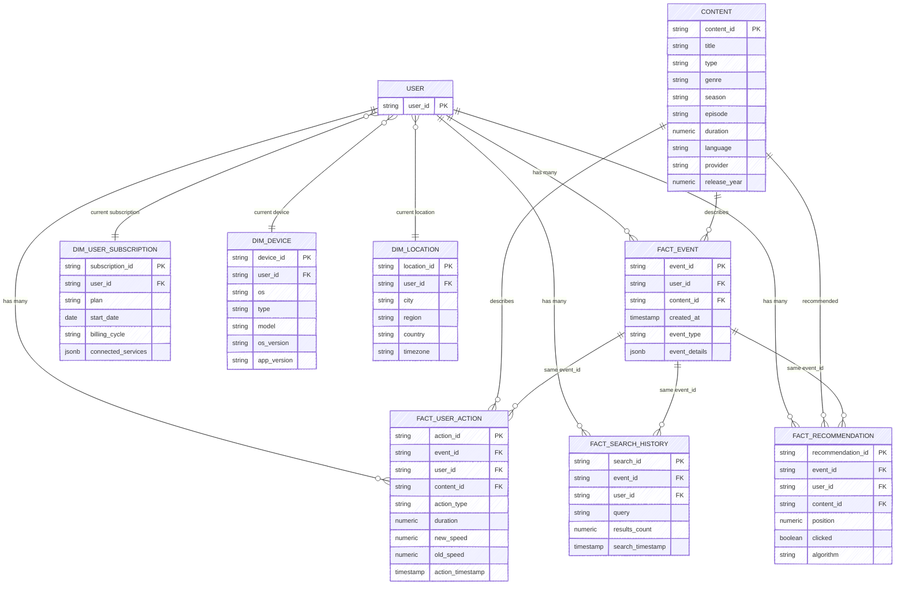

```mermaid
---
config:
  look: handDrawn
---
erDiagram

    USER ||--o{ FACT_EVENT : "has many"
    USER ||--o{ FACT_USER_ACTION : "has many"
    USER ||--o{ FACT_SEARCH_HISTORY : "has many"
    USER ||--o{ FACT_RECOMMENDATION : "has many"

    CONTENT ||--o{ FACT_EVENT : "describes"
    CONTENT ||--o{ FACT_USER_ACTION : "describes"
    CONTENT ||--o{ FACT_RECOMMENDATION : "recommended"

    FACT_EVENT ||--o{ FACT_USER_ACTION : "same event_id"
    FACT_EVENT ||--o{ FACT_SEARCH_HISTORY : "same event_id"
    FACT_EVENT ||--o{ FACT_RECOMMENDATION : "same event_id"

    USER }o--|| DIM_USER_SUBSCRIPTION : "current subscription"
    USER }o--|| DIM_DEVICE : "current device"
    USER }o--|| DIM_LOCATION : "current location"

    USER {
        string user_id PK
    }

    FACT_EVENT {
        string event_id PK
        string user_id FK
        string content_id FK
        timestamp created_at
        string event_type
        jsonb event_details
    }

    FACT_USER_ACTION {
        string action_id PK
        string event_id FK
        string user_id FK
        string content_id FK
        string action_type
        numeric duration
        numeric new_speed
        numeric old_speed
        timestamp action_timestamp
    }

    FACT_SEARCH_HISTORY {
        string search_id PK
        string event_id FK
        string user_id FK
        string query
        numeric results_count
        timestamp search_timestamp
    }

    FACT_RECOMMENDATION {
        string recommendation_id PK
        string event_id FK
        string user_id FK
        string content_id FK
        numeric position
        boolean clicked
        string algorithm
    }

    CONTENT {
        string content_id PK
        string title
        string type
        string genre
        string season
        string episode
        numeric duration
        string language
        string provider
        numeric release_year
    }

    DIM_USER_SUBSCRIPTION {
        string subscription_id PK
        string user_id FK
        string plan
        date start_date
        string billing_cycle
        jsonb connected_services
    }

    DIM_DEVICE {
        string device_id PK
        string user_id FK
        string os
        string type
        string model
        string os_version
        string app_version
    }

    DIM_LOCATION {
        string location_id PK
        string user_id FK
        string city
        string region
        string country
        string timezone
    }
```
