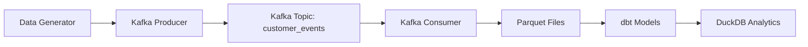

# Streaming Data Pipeline Project

## Overview

This project implements a real-time streaming data pipeline that generates synthetic customer event data, streams it through Apache Kafka, and persists the data in Parquet format for further analysis. The pipeline demonstrates modern data engineering practices including schema management with Avro, containerized infrastructure, and data transformation with dbt.

## Architecture



## Components

### Data Generation (`src/producer/`)

The producer component generates realistic customer event data using the Faker library. Events include:

- **Device Information**: Type, OS, version, app version, model
- **Location Data**: Country, city, region, timezone
- **Content Details**: Media ID, title, type, episode/season, provider, genre, etc.
- **Event Types**: content_play, search, browse
- **User Actions**: Playback controls, quality changes, pauses
- **Recommendations**: Content suggestions with algorithms
- **Search History**: Previous search queries

**Key Files:**
- `generate_consumer.py`: Main data generation logic
- `CustomerEvents/`: Modular event component generators
- `Schema/v1.avsc`: Avro schema definition
- `kafka_producer.py`: Kafka producer with schema registry integration

### Data Consumption (`src/consumer/`)

The consumer subscribes to the `customer_events` Kafka topic, processes Avro-encoded messages, and batches them before writing to Parquet files.

**Key Features:**
- Avro deserialization with schema registry
- Batch processing (1200 messages per file)
- Automatic Parquet file generation with UUID-based naming
- JSON normalization for complex nested data

**Key Files:**
- `consumer.py`: Main consumer logic
- `savejson.py`: Parquet writing utility

### Data Transformation (`dbt/`)

Uses dbt (Data Build Tool) for SQL-based data transformations on the ingested Parquet data.

**Key Files:**
- `dbt_project.yml`: Project configuration
- `models/`: SQL transformation models
- `profiles.yml`: Database connection profiles

### Infrastructure (`docker-compose.yml`)

Containerized Kafka ecosystem including:
- Zookeeper
- Kafka Broker
- Schema Registry
- Kafka UI (web interface)
- PostgreSQL (optional)
- DuckDB (for analytics)

## Data Flow

1. **Generation**: Synthetic events created using Faker library
2. **Serialization**: Events serialized to Avro format using defined schema
3. **Streaming**: Messages published to Kafka topic with schema registry
4. **Consumption**: Consumer processes messages in batches
5. **Persistence**: Data written to Parquet files in `parquet_data/data/`
6. **Transformation**: dbt models transform data for analysis
7. **Analytics**: DuckDB queries processed data

## Setup and Usage

### Prerequisites

- Docker and Docker Compose
- Python 3.8+
- Required Python packages (see `requirements.txt`)

### Running the Pipeline

1. **Start Infrastructure:**
   ```bash
   docker-compose up -d
   ```

2. **Run Producer:**
   ```bash
   cd src/producer
   python test.py  # Or your producer script
   ```

3. **Run Consumer:**
   ```bash
   cd src/consumer
   python consumer.py
   ```

4. **Monitor with Kafka UI:**
   - Access at `http://localhost:8080`

### Data Output

Parquet files are stored in `parquet_data/data/` with UUID-based filenames. Each file contains up to 1200 customer events with the following schema:

- device (nested)
- location (nested)
- content (nested)
- event_type
- user_subscription (nested)
- timestamp
- event_details (nested)
- user_action (array)
- recommendations (array)
- search_history (array)

## Configuration

### Kafka Settings
- Topic: `customer_events`
- Broker: `kafka:9092`
- Schema Registry: `http://schema-registry:8081`

### Consumer Batch Size
- Configurable in `consumer.py` (default: 1200 messages per file)

## Development

### Adding New Event Types

1. Update `Schema/v1.avsc` with new fields
2. Modify generators in `CustomerEvents/`
3. Update consumer deserialization if needed

### Custom Data Generation

Extend `generate_consumer.py` to add new data patterns or modify existing generators in the `CustomerEvents/` directory.

## Monitoring and Debugging

- **Kafka UI**: Web interface for topic monitoring
- **Logs**: Custom logging in `custom_logging.py`
- **Consumer Output**: Parquet file generation confirmations
- **Schema Validation**: Automatic with Avro schema registry

## Future Enhancements

- Real-time stream processing with KSQL
- Advanced analytics dashboards
- Machine learning model integration
- Multi-topic support
- Cloud deployment configurations</content>
<parameter name="filePath">/workspaces/POC-Data-Engineering/src/README.md